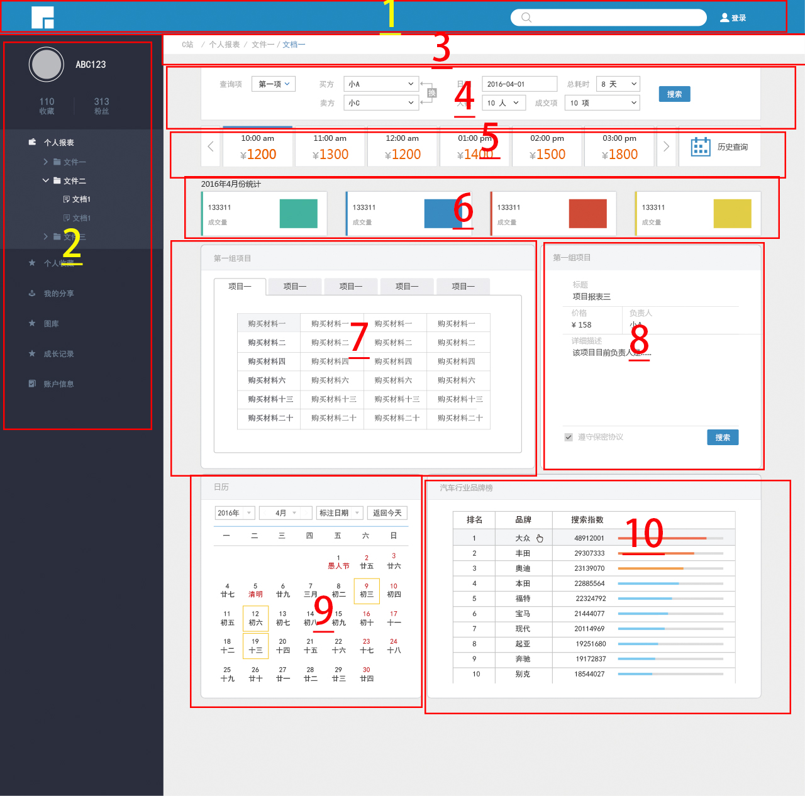

### 任务说明
1. 页面的没有给出尺寸数据，我们暂定页面宽度1280px
2. 页面各部分尺寸数据见各部分任务说明，只是暂定，具体的，编写者可以根据情况进行调整，但是注意整体性。
### 任务分区以及说明
1. title，占满页面，高度根据情况自定，难度1
2. 在侧分区，占页面宽度的320px，相关折叠只要实现一个做为示例，不过要做到其它的可以基于此快速实现，难度7
3. 子页面头，相关样式根据情况自定，难度1
4. 占用此部分的960px，难度5
5. 占用此部分的960px，注意hover的css定制，难度5
6. 占用此部分的960px，难度4
7. 占用此部分的480px, 可以试试使用css实现tab的切换，可以加上hover的css定制，难度6
8. 占用此部分的335px，难度5
9. 占用此部分的335px，注意图中选中时的css变化，可以加上hover的css定制，难度7
10. 占用此部分的480px，注意hover的css定制，难度7

### 任务分配
池翔：1､ 4、7
王欢：2､ 6、9
罗玄：3、5、8､ 10

### 说明
1. 有图片的文件夹已经建好，文件夹命分为：part_n
2. 文件命分为：part_01.html, part_02.html...part_10.html等
3. 子部分div或section id命名示例：part-01, part-02
4. 子部分内部元素class或id命名示例：p1idname, p1classname

### 任务划分图

